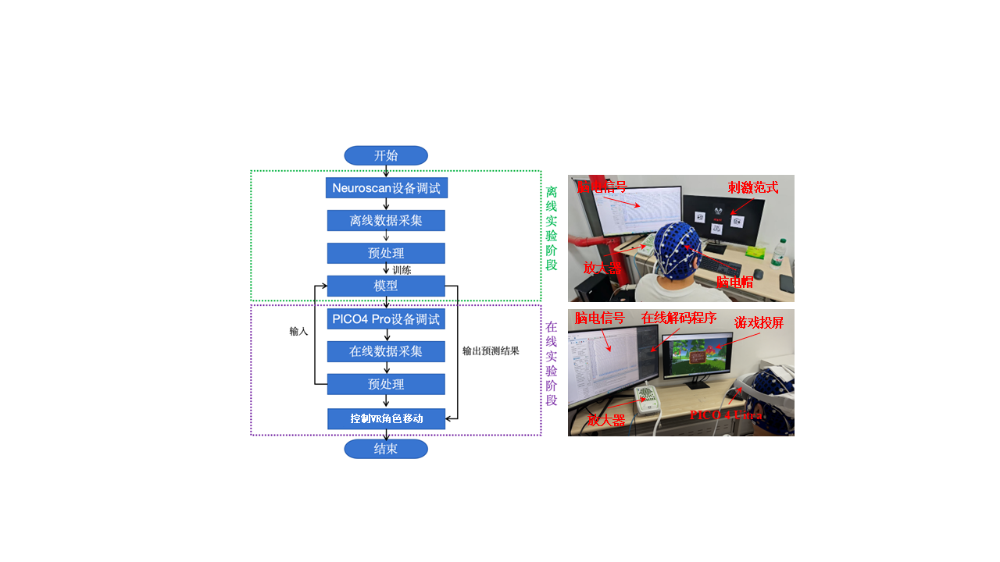

# MetaBCI-USTB

## Welcome! 
该工程为2025世界机器人大赛-BCI脑控机器人大赛MetaBCI创新应用开发赛项的代码。

## Basic information！
项目名称：面向轻度认知障碍的BCI-VR交互训练系统                 
队伍名称：北科数字疗法队         
队伍单位：北京科技大学   
团队成员：梁光金 杨思雨 袁胜豪 徐晨阳 邢风
所属赛道：主动控制赛道        

## Project Introduction！
轻度认知障碍（MCI）是阿尔茨海默病早期阶段，亟需创新的非药物数字疗法。本项目旨在开发基于脑机接口（BCI）与虚拟现实（VR）的游戏化训练系统，助力MCI患者认知康复。系统以MetaBCI为基础，新增四分类运动想象（MI）范式支持，开发听声辨位VR游戏，通过脑电控制游戏角色移动捕捉游戏中的动物，从而提升患者空间认知、执行功能和大脑活跃度。项目拟在MetaBCI平台新增多分类脑电解码算法、特征提取与模型训练方法，开发模型可视化技术，适配OpenBCI设备及VR场景任务，并构建四分类MI数据集。项目预期应用于医疗机构与居家康复场景，通过趣味性游戏化训练增强患者依从性，显著改善注意力、记忆力和空间认知等功能，为BCI-VR技术在神经康复领域的应用提供新范式。

## Project technical path！
依托MetaBCI开源平台架构，“面向轻度认知障碍的BCI-VR交互训练系统”项目高效集成了MI编解码、VR平台呈现、VR游戏交互等通信流程，实现4指令BCI-VR交互训练系统。
* 在刺激呈现方面，调用brainstim子平台下新增的4分类MI范式，采集MI脑电信号。
* 在信号处理方面，对brainda子平台新增熵特征提取算法，用于对采集的脑电信号进行特征分析。
* 在信号解码方面，对brainda子平台新增MI范式识别算法EEG-Conformer，对用户脑电信号进行特征提取与模式识别，解码为外设指令。
* 在外设控制方面，对brainflow子平台新增VR游戏通信控制模块，通过Socket协议将意图指令发送至VR游戏，控制VR角色完成指定任务动作。

项目技术路径图

## Code testing instructions！
需要在原有的环境下添加einops==0.8.1和keyboard==0.13.5两个新的软件库（该部分内容已在“requirements.txt”文件中体现）。

需要将MetaMCI离线demo数据“MI”放到“/demos/brainflow_demos/data”文件夹下面。

制作的听声辨位游戏的APK安装文件[metabcites791.apk.1](https://drive.google.com/file/d/1FN9KyAnlG2NWmN0M2kGu_J3Ve9mmhP_1/view?usp=sharing”)，进行在线功能测试时需要将该安装包拷贝并安装到PICO 4 Uitra中。

进行测试的文件主要为：stim_demo.py、Offline_mi4c_new.py和Online_mi4c_new.py三个文件。在stim_demo.py和Offline_mi4c_new.py文件上的详细的测试过程在“5.新增功能点说明”和“6.修复功能点说明”部分进行了详细的说明。下面主要介绍Online_mi4c_new.py文件的测试流程：
* 首先确保脑电信号采集和程序运行在同一个主机上，然后将主机和PICO 4 Uitra连接到同一个路由器；
* 连接32导联NeuroScan设备，脑电帽使用导电膏版本的脑电帽，佩戴好脑电帽，将所有导联的阻抗调整到10KΩ以下；
* 设置Curry9软件信号采集参数，选用M1和M2作为参考电极，采样频率为256Hz，进行50Hz陷波滤波和1Hz-50Hz的带通滤波，启用Curry9软件中的LSL功能；
* 打开Curry9软件的信号采集功能；
* 修改文件中的“MODEL_PATH”变量的值为当前电脑下的模型的路径；
* 运行Online_mi4c_new.py文件，此时程序等待连接PICO 4 Uitra，被试佩戴PICO 4 Uitra并打开安装好的游戏，程序和PICO 4 Uitra即可完成连接；
* 然后Online_mi4c_new.py程序将会先进行离线数据准确率验证，最后分类结果为5折交叉验证的平均准确率；
* 得到准确率后，程序提示"按空格键开始实时解码..."，需要主试人员点击空格开始正式的在线实验；
* 在线实验选择5折交叉验过程中保存的5个模型中的在测试集上最优的模型。完整的在线实验流程也在提交的视频中体现。

